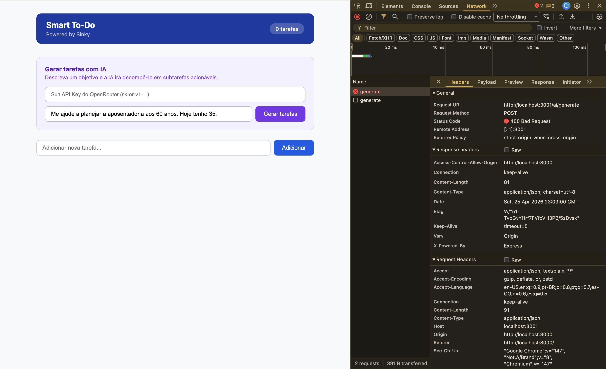
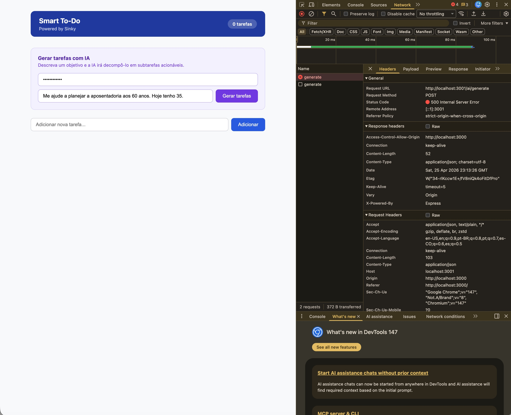
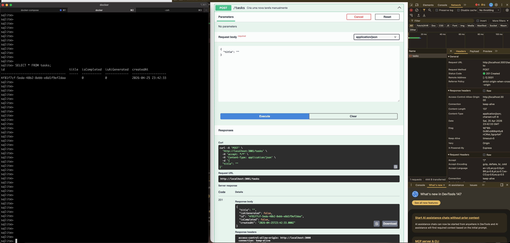
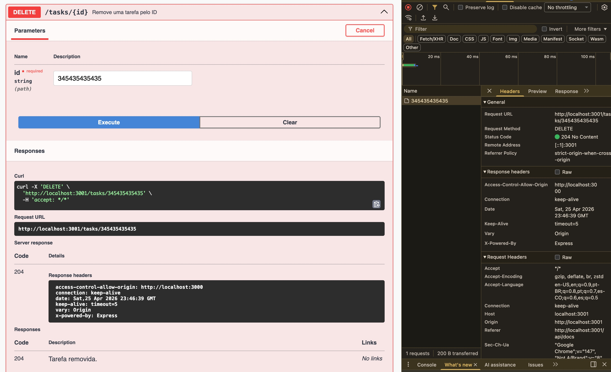
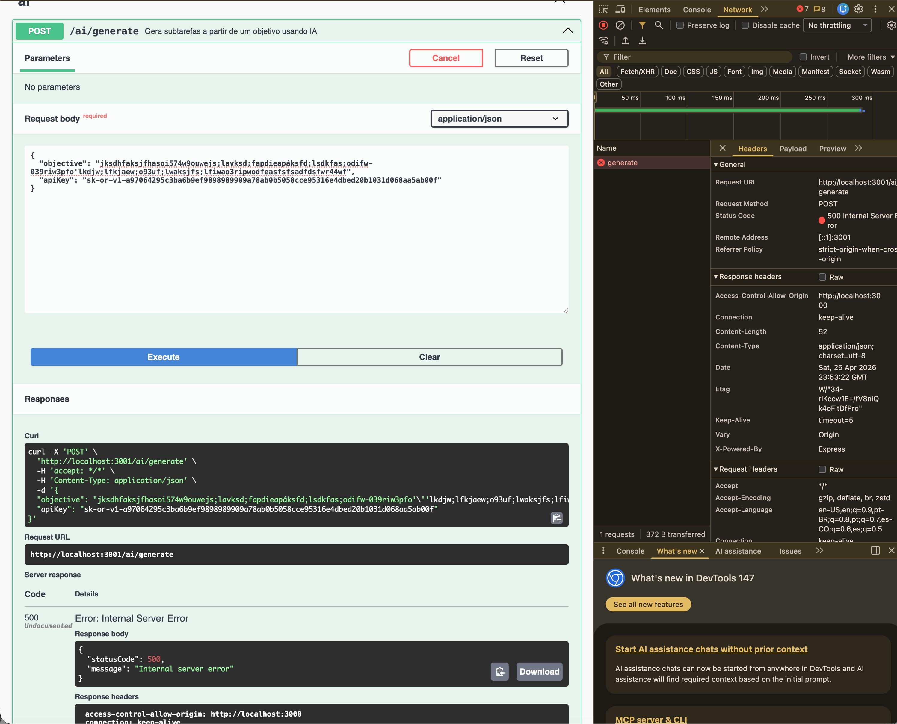

# BUG-REPORT — Smart To-Do List com IA

Este documento reúne os defeitos identificados durante a sessão de testes exploratórios da aplicação Smart To-Do, realizada após a revisão do PRD v1.2. Os testes cobriram a interface, os contratos de API via Swagger e comportamentos de borda. Os itens foram classificados por severidade e prioridade para orientar a correção.

## [BUG-001] Marcar tarefa como concluída não persiste após recarregar a página

**Severidade:** Crítica
**Prioridade:** P1
**Componente:** Frontend | Backend

**Descrição**

Ao marcar uma tarefa como concluída, a alteração visual ocorre na interface mas nenhuma requisição é enviada ao backend. Após recarregar a página, a tarefa volta ao estado anterior (não concluída). Confirmado via aba Network do browser (sem requisição) e consulta direta ao banco de dados (campo `isCompleted` permanece `0`).

**Passos para Reproduzir**

1. Acessar a aplicação em http://localhost:3000
2. Criar uma tarefa manualmente
3. Clicar no checkbox para marcar a tarefa como concluída
4. Recarregar a página (F5)

**Resultado Esperado**

A tarefa deve permanecer marcada como concluída após o reload, com o estado persistido no banco de dados.

**Resultado Obtido**

A tarefa volta ao estado "não concluída" após o reload. Nenhuma requisição é enviada ao backend no momento do clique — confirmado na aba Network do DevTools e no banco via `SELECT * FROM tasks` (campo `isCompleted` = 0).

**Evidência**

- [Vídeo](./evidencias-testes/BUG_001_Marcar_tarefa_como_concluida_nao_persiste.mov)


**Sugestão de Correção**

Implementar a chamada ao endpoint de atualização de tarefa (PATCH/PUT) no evento de clique do checkbox, enviando o novo estado de `isCompleted` ao backend antes de atualizar a interface.

---

## [BUG-002] Submissão de formulário de criação de tarefa com campo vazio não exibe feedback ao usuário

**Severidade:** Média
**Prioridade:** P2
**Componente:** Frontend | UX

**Descrição**

Ao tentar criar uma tarefa com o campo de título vazio e confirmar o formulário, nenhuma ação visível ocorre na interface. O usuário não recebe nenhum feedback de erro ou validação, ficando sem entender o que aconteceu.

**Passos para Reproduzir**

1. Acessar a aplicação em http://localhost:3000
2. Deixar o campo de título vazio
3. Clicar no botão de confirmação

**Resultado Esperado**

O sistema deve exibir uma mensagem de erro informando que o campo é obrigatório, ou o botão de confirmação deve estar desabilitado enquanto o campo estiver vazio.

**Resultado Obtido**

Nenhuma ação ocorre na interface. Sem mensagem de erro, sem feedback visual, sem indicação de que o campo é obrigatório.

**Evidência**

- [Vídeo](./evidencias-testes/BUG_002_Submiss%C3%A3o_de_formul%C3%A1rio_de_cria%C3%A7%C3%A3o_de_tarefa_com_campo_vazio.mov)

**Sugestão de Correção**

Adicionar validação no frontend: desabilitar o botão de confirmação enquanto o campo estiver vazio, ou exibir mensagem de erro ao tentar submeter o formulário sem preencher o título.

---

## [BUG-003] Campo de título de tarefa aceita textos sem limite de caracteres

**Severidade:** Média
**Prioridade:** P3
**Componente:** Frontend | Backend

**Descrição**

O campo de título da tarefa não possui nenhum limite de caracteres. Foi possível inserir em torno de 102.000 caracteres caracteres sem nenhum erro ou aviso. O dado foi persistido no banco de dados normalmente. Porém o ideal seria definir um limite no próprio frontend

**Passos para Reproduzir**

1. Acessar a aplicação em http://localhost:3000
2. Inserir um texto com mais de 102.000 caracteres no campo de título
3. Confirmar a criação da tarefa

**Resultado Esperado**

O sistema deve limitar o número de caracteres aceitos no campo de título e exibir feedback ao usuário caso o limite seja atingido.

**Resultado Obtido**

O texto é aceito e salvo no banco sem nenhuma validação de tamanho

**Evidência**

- [Arquivo de Exemplo](./evidencias-testes/BUG_003_exemplo_de_arquivo_102300_caracteres.txt)

**Sugestão de Correção**

Definir e implementar um limite máximo de caracteres no campo no frontend e se for o caso até no backend, retornando erro 400 caso o limite seja excedido.

---

## [BUG-004] Tentativa de gerar tarefas sem API Key não exibe feedback ao usuário

**Severidade:** Alta
**Prioridade:** P2
**Componente:** Frontend | UX

**Descrição**

Ao tentar acionar a geração de tarefas por IA sem ter configurado uma API Key, o backend retorna um erro Bad Request mas nenhuma mensagem é exibida na interface. O usuário não tem como saber o que aconteceu ou o que precisa fazer para resolver.

**Passos para Reproduzir**

1. Acessar a aplicação em http://localhost:3000
2. Não inserir nenhuma API Key no campo de configuração
3. Digitar um objetivo no campo de geração por IA
4. Confirmar a geração

**Resultado Esperado**

O sistema deve informar ao usuário que é necessário configurar uma API Key antes de usar a funcionalidade de geração por IA

**Resultado Obtido**

Nenhum feedback é exibido na interface. O backend retorna Bad Request mas o erro é silencioso para o usuário.

**Evidência**

- 


**Sugestão de Correção**

Tratar o erro no frontend e exibir uma mensagem amigável para o usuário

---

## [BUG-005] Inserção de API Key inválida não retorna erro na interface

**Severidade:** Alta
**Prioridade:** P2
**Componente:** Frontend | UX

**Descrição**

Ao inserir uma API Key inválida e tentar gerar tarefas, o backend retorna erro mas nenhuma mensagem é exibida ao usuário na interface. O usuário não consegue identificar que a chave está incorreta.

**Passos para Reproduzir**

1. Acessar a aplicação em http://localhost:3000
2. Inserir uma API Key inválida no campo de configuração
3. Digitar um objetivo no campo de geração por IA
4. Confirmar a geração

**Resultado Esperado**

O sistema deve exibir uma mensagem informando que a API Key é inválida ou que não foi possível autenticar com o provedor, orientando o usuário a verificar a chave inserida.

**Resultado Obtido**

Nenhum feedback é exibido na interface deixando o usuário sem entender o motivo da falha.

**Evidência**

- 

- Retorno do backend:
    ````
    smart-todo-backend  | [Nest] 1  - 04/25/2026, 11:13:26 PM   ERROR [ExceptionsHandler] Request failed with status code 401
    smart-todo-backend  | AxiosError: Request failed with status code 401
    smart-todo-backend  |     at settle (/app/node_modules/axios/dist/node/axios.cjs:1970:12)
    smart-todo-backend  |     at IncomingMessage.handleStreamEnd (/app/node_modules/axios/dist/node/axios.cjs:3377:11)
    smart-todo-backend  |     at IncomingMessage.emit (node:events:536:35)
    smart-todo-backend  |     at endReadableNT (node:internal/streams/readable:1698:12)
    smart-todo-backend  |     at process.processTicksAndRejections (node:internal/process/task_queues:82:21)
    smart-todo-backend  |     at Axios.request (/app/node_modules/axios/dist/node/axios.cjs:4517:41)
    smart-todo-backend  |     at process.processTicksAndRejections (node:internal/process/task_queues:95:5)
    smart-todo-backend  |     at async AiService.generateSubtasks (/app/dist/ai/ai.service.js:15:26)
    smart-todo-backend  |     at async AiController.generate (/app/dist/ai/ai.controller.js:27:24)
    smart-todo-backend  |     at async /app/node_modules/@nestjs/core/router/router-execution-context.js:46:28
    smart-todo-backend  |     at async /app/node_modules/@nestjs/core/router/router-proxy.js:9:17
    ````

---

**Sugestão de Correção**

Tratar o erro de autenticação retornado pelo provedor de IA e exibir mensagem clara ao usuário

---

## [BUG-006] API aceita criação de tarefa com título vazio

**Severidade:** Alta
**Prioridade:** P2
**Componente:** Backend | API

**Descrição**

O endpoint `POST /tasks` aceita e persiste tarefas com o campo `title` vazio ou em branco, sem retornar nenhum erro de validação. Isso complementa o BUG-002, confirmando que a ausência de validação existe tanto no frontend quanto no backend.

**Passos para Reproduzir**

1. Acessar http://localhost:3001/api/docs
2. Expandir o endpoint `POST /tasks`
3. Enviar o payload `{ "title": "" }`
4. Verificar a resposta e o banco de dados

**Resultado Esperado**

A API deve retornar status 400 (Bad Request) com mensagem informando que o título é obrigatório e não pode ser vazio.

**Resultado Obtido**

A API retorna status 201 (Created) e a tarefa é salva no banco com título vazio.

**Evidência**

- 

**Sugestão de Correção**

Adicionar validação no backend, retornando 400 caso estiver vazio

---

## [BUG-007] DELETE com ID inexistente retorna sucesso ao invés de 404

**Severidade:** Alta
**Prioridade:** P2
**Componente:** Backend | API

**Descrição**

O endpoint `DELETE /tasks/{id}` retorna resposta de sucesso mesmo quando o ID informado não existe no banco de dados.

**Passos para Reproduzir**

1. Acessar http://localhost:3001/api/docs
2. Expandir o endpoint `DELETE /tasks/{id}`
3. Inserir um ID inválido ou inexistente (ex: `id-que-nao-existe`)
4. Executar a requisição e verificar a resposta

**Resultado Esperado**

A API deve retornar status 404 (Not Found) com mensagem informando que a tarefa não foi encontrada.

**Resultado Obtido**

A API retorna resposta de sucesso mesmo sem encontrar nenhum registro correspondente ao ID informado no banco de dados.

**Evidência**

- 

**Sugestão de Correção**

Verificar no service se o registro existe antes de executar o DELETE. Caso não encontre, retornar 404

---

## [BUG-008] Endpoint de geração por IA retorna 500 ao invés de 401 quando a API Key é inválida

**Severidade:** Alta
**Prioridade:** P2
**Componente:** Backend | API

**Descrição**

O endpoint `POST /ai/generate` retorna status 500 (Internal Server Error) quando recebe uma API Key inválida, ao invés de retornar um erro mais específico como 401 (Unauthorized) ou 400 (Bad Request).

**Passos para Reproduzir**

1. Acessar http://localhost:3001/api/docs
2. Expandir o endpoint `POST /ai/generate`
3. Enviar uma API Key inválida no payload
4. Verificar o status code da resposta

**Resultado Esperado**

A API deve retornar status 401 (Unauthorized) ou 400 (Bad Request) com mensagem explicativa informando que a autenticação com o provedor de IA falhou.

**Resultado Obtido**

A API retorna status 500 (Internal Server Error) ao invés de tratar o erro que vem da api da IA e retornar esse erro

**Evidência**

- 

- Log do backend:
    ```
    smart-todo-backend  | [Nest] 1  - 04/25/2026, 11:54:50 PM   ERROR [ExceptionsHandler] Request failed with status code 401
    smart-todo-backend  | AxiosError: Request failed with status code 401
    smart-todo-backend  |     at settle (/app/node_modules/axios/dist/node/axios.cjs:1970:12)
    smart-todo-backend  |     at IncomingMessage.handleStreamEnd (/app/node_modules/axios/dist/node/axios.cjs:3377:11)
    smart-todo-backend  |     at IncomingMessage.emit (node:events:536:35)
    smart-todo-backend  |     at endReadableNT (node:internal/streams/readable:1698:12)
    smart-todo-backend  |     at process.processTicksAndRejections (node:internal/process/task_queues:82:21)
    smart-todo-backend  |     at Axios.request (/app/node_modules/axios/dist/node/axios.cjs:4517:41)
    smart-todo-backend  |     at process.processTicksAndRejections (node:internal/process/task_queues:95:5)
    smart-todo-backend  |     at async AiService.generateSubtasks (/app/dist/ai/ai.service.js:15:26)
    smart-todo-backend  |     at async AiController.generate (/app/dist/ai/ai.controller.js:27:24)
    smart-todo-backend  |     at async /app/node_modules/@nestjs/core/router/router-execution-context.js:46:28
    smart-todo-backend  |     at async /app/node_modules/@nestjs/core/router/router-proxy.js:9:17

    ```

**Sugestão de Correção**

Capturar o erro retornado pela LLM e relançá-lo com o status code correto.


## Observação

O endpoint PATCH /tasks/:id aceita alteração do campo title, funcionalidade prevista para versões futuras mas fora do escopo atual (PRD v1.2). É recomendado alinhar com o time se essa capacidade deve ser mantida, restringida ou documentada até o lançamento oficial da feature.